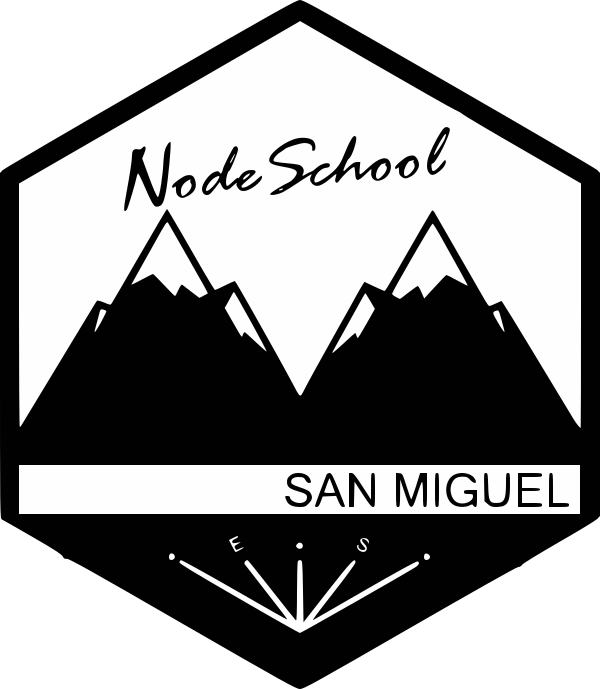

# ¿Te interesa unirte a _NodeSchool San Miguel_?

Para unirte solicita una invitación para ser incluido a la lista de miembros por **SLACK** en donde se ponen notificaciones sobre las actividades de la comunidad, puedes hacerlo en el link de abajo.

## Redes Sociales :fire:

<table>
<tbody>
<td align="center">
<a href="https://www.facebook.com/nodeschoolsm/"> Facebook</a>
</td>
<td align="center">
<a href="https://www.instagram.com/nodeschoolsm/"> Instagram</a>
</td>
</tbody>
</table>

---

# ¿Qué somos?

Somos una comunidad que se enfoca en compartir conocimiento de manera gratuita a personas en El Salvador, especialmente en la zona Oriental, y titularnos como “La primera comunidad en oriente dedicada al desarrollo y la tecnología”, si es cierto en el país hay muchas comunidades similares, pero en el área oriental nunca se ha conocido alguna, es probable que existan otras comunidades pero no de forma pública, por el motivo que son desarrolladas por estudiantes y nunca salen de los muros de sus centros de estudio. La mayoría de nuestros miembros son estudiantes universitarios de distintas instituciones de San Miguel, rompiendo así el esquema de estar divididos y logrando convivencia entre miembros aunque estos sean de distintas instituciones.

Uno de los principales objetivos de NodeSchool San Miguel es que en un futuro no muy lejano la comunidad sea el puente directo en el área de tecnología con otras zonas del país, ya que la sensación de estar "olvidados" se puede percibir, pero sabemos que es probable que esto sea por el motivo que no hay una forma de establecer contacto, ese puede ser el papel de la comunidad; servir como puente y a lo mejor como una pequeña bolsa de trabajo para obtener talento humano es ésta zona del país, dándole una oportunidad a las personas que no pueden trasladarse a la zona central en busca de oportunidades laborales.

# ¿Qué hacemos?

NodeSchool San Miguel intenta impartir conocimiento sobre tecnologías de desarrollo más novedosas y mayormente utilizadas en el mundo por otras comunidades de desarrolladores o empresas de renombre internacional. La dinámica es que cualquier persona puede dar un taller o una charla con respecto a temas de tecnología preferiblemente, pero no estamos cerrados a que se impartan recursos sobre otro tipo de conocimientos que pueden estar relacionados con la informática indirectamente, ya que al final de cuentas todo trata en adquirir conocimiento que pueda ser de utilidad en el mundo laboral, y por qué no en el del emprendedor.

Incentivando la integración de las personas, NodeSchool San Miguel no tiene límite de edad para sus asistentes, porque ese es el rumbo que se desea que tome, en donde personas mayores puedan compartir sus conocimientos con lo que están empezando, idea que está funcionando muy bien por el momento, aparte que le da la oportunidad a estas personas de seguir motivadas por querer aprender más y no estar desactualizados.

# ¿Cuánto cuesta?

Bueno es completamente gratis, ¿Qué estás esperando para ser parte de nosotros?

# ¿Se gana algo organizando todo esto?

No, y no, es completamente sin fines lucrativos, todo el tiempo que puede llevar la organización de esta iniciativa es gracias a la colaboración de personas proactivas que estén dispuestas a poner su grano de arena y seguir con lo lineamientos del proyecto que es; colaborar para un bien común, específicamente ayudar a las personas que tienen el deseo de obtener más conocimientos pero a la misma vez compartir los que poseen en la tecnología.

# Razones para unirte

- [x] ¡Completamente Gratis!
- [x] Una comunidad proactiva dispuesta a colaborarte.
- [x] Compartir el conocimiento es uno de nuestros principales objetivos.

La lista puede seguir...

# Soy nuevo y quiero leer sobre lo que han impartido en los meetups

Debido a que hay casos en los cuales un miembro no puede asistir o eres alguien nuevo, se ha establecido un directorio para almacenar el material que se imparte en cada charla/taller, así tendrás una idea de los temas. [meetups](meetups)

# Actividades a realizar

En nodeschool dado que hay muchísimos temas de desarrollo Web tanto frontend como backend, y muchos lenguajes para hacer distintas cosas relacionadas a este tema, se ha tomado a bien presentar talleres y charlas impartidas por todos los miembros de nodeschool, además de si un día no se cuenta con charla o taller los organizadores se hace responsables de hacer actividades que de cierta manera saquen más nuestra humanidad, discutiendo temas entre miembros, realizando proyectos entre otras cosas geniales, todo esto junto con retos súper interesantes que -depende de los miembros si se dan a flote-.

Miremos Nodeschool San Miguel ( por ahora) como una comunidad en la que vos llegas presentas algun tema relacionado a desarrollo web, sea hardware, software, iot, asistencia técnica, lo que sea., y a los miembros les mostras lo que has aprendido porque te gusta lo que haces vos con el tópico en cuestión.

> **depende de los miembros si se dan a flote** , que significa?

En Nodeschool servimos como puente para impartir temas que se ven actualmente por desarrolladores grandiosos que intentamos imitar, dependera de cáda miembro si mejorar habilidades relacionadas a dichos temas o no.

# ¿Deseas colaborar manteniendo el sitio?

Yaay :zap: :rainbow: cualquier PR es bienvenido, por el momento se sigue la guía de estilos de **Airbnb** para reactjs, pero con un distintivo :: **siempre comillas dobles ["] para strings, sniff: el teclado latam :keyboard::heart_eyes:**

- [Guía de estilos para JS](https://github.com/airbnb/javascript/tree/master/react)
- [Website src](./website)
- [Guía de estilos para git](https://github.com/horchatajs/website/blob/master/.github/GIT_STYLEGUIDE.md), psst: tomada de https://github.com/horchatajs

# Organizadores

> Si lo fuiste una vez, seguiras en esta lista <3

<table>
<tbody>
<tr>
<td>

</td>
<td>

</td>
</tr>
<tr>
<td>

</td>
<td>

</td>
</tr>
</tbody>
</table>

# “Quiero patrocinarlos”

¿En serio?, Genial :), envíanos un mensaje a nuestra página de facebook, ponte en contacto con cualquiera de los organizadores

# Código de conducta

Queremos que NodeSchool San Miguel sea una comunidad sana, para tal motivo se necesita establecer un código de conducta el cual te invitamos a leer y respetarlo. [Código de Conducta](CODE_OF_CONDUCT.md)

# Contacto

- Sitio Web: https://nodeschool.io/sanmiguel/
- Instagram: https://www.instagram.com/nodeschoolsm/
- Facebook: https://www.facebook.com/nodeschoolsm/
- GitHub: https://github.com/nodeschool/sanmiguel
- Email: nodeschoolsm@gmail.com
