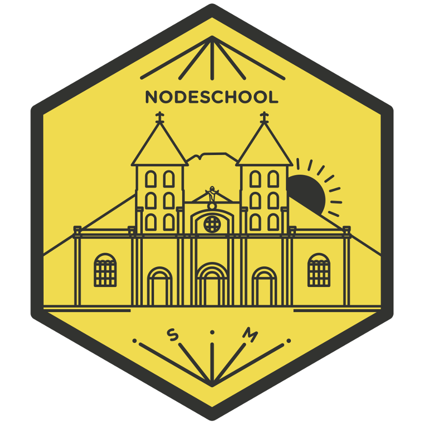

# ¿Te interesa unirte a *NodeSchool San Miguel*?

Para unirte solicita una invitación para ser incluido a la lista de miembros por **SLACK** en donde se ponen notificaciones sobre las actividades de la comunidad, puedes hacerlo en el link de abajo.

# ¿Cuánto cuesta?

Bueno es completamente gratis, ¿Qué estás esperando para ser parte de nosotros?

# Razones para unirte

- [x] ¡Completamente Gratis!
- [x] Una comunidad proactiva dispuesta a colaborarte.
- [x] Compartir el conocimiento es uno de nuestros principales objetivos.

La lista puede seguir...

# Soy nuevo y quiero leer sobre lo que han impartido en los meetUps

Debido a que hay casos en los cuales un miembro no puede asistir o eres alguien nuevo, se ha establecido un directorio para almacenar el material que se imparte en cada charla/taller, así tendrás una idea de los temas. [meetups](meetups)

# Actividades

En nodeschool dado que hay muchísimos temas de desarrollo Web tanto frontend como backend, y muchos lenguajes para hacer distintas cosas relacionadas a este tema, se ha tomado a bien presentar talleres y charlas impartidas por todos los miembros de nodeschool, además de si un día no se cuenta con charla o taller los organizadores se hace responsables de hacer actividades que de cierta manera saquen más nuestra humanidad, discutiendo temas entre miembros, realizando proyectos entre otras cosas geniales, todo esto junto con retos súper interesantes que -depende de los miembros si se dan a flote-.

Miremos Nodeschool San Miguel ( por ahora) como una comunidad en la que vos llegas presentas algun tema relacionado a desarrollo web, sea hardware, software, iot, asistencia técnica, lo que sea., y a los miembros les mostras lo que has aprendido porque te gusta lo que haces vos con el tópico en cuestión.

> **depende de los miembros si se dan a flote** , que significa?

En Nodeschool servimos como puente para impartir temas que se ven actualmente por desarrolladores grandiosos que intentamos imitar, dependera de cáda miembro si mejorar habilidades relacionadas a dichos temas o no.

- [Calendario de actividades](https://calendar.google.com/calendar?cid=dDJjbjJuM3RoZmI5bDRpdWhqYjZ1MmFhZTBAZ3JvdXAuY2FsZW5kYXIuZ29vZ2xlLmNvbQ)

# ¿Deseas colaborar manteniendo el sitio?

Yaay :zap: :rainbow: cualquier PR es bienvenido, por el momento se sigue la guía de estilos de **Airbnb** para reactjs, pero con un distintivo :: **siempre comillas dobles ["] para strings, sniff: el teclado latam :keyboard::heart_eyes:**

- [Guía de estilos](https://github.com/airbnb/javascript/tree/master/react)
- [Website](./website)

# Código de conducta

Queremos que NodeSchool San Miguel sea una comunidad sana, para tal motivo se necesita establecer un código de conducta el cual te invitamos a leer y respetarlo. [Código de Conducta](CODE_OF_CONDUCT.md)

# Organizadores

<table>
<tbody>
<tr>
<td>

</td>
<td>

</td>
</tr>
<tr>
<td>

</td>
<td>

</td>
</tr>
</tbody>
</table>