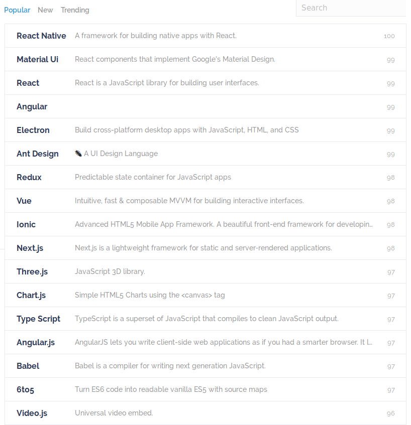

# Javascript in a nutshell

JavaScript fue creado por Brendan Eich en 1995 mientras trabajaba en Netscape. Su intención original era crear un lenguaje simple para sitios web, complementándolo con Java para aplicaciones más complejas.

Sin embargo, JavaScript no sólo se limita a los navegadores web: Node.js proporciona un entorno de ejecución independiente para el motor V8 de Google Chrome que lo volvio masivamente popular

## Versiones de JS

- Primero que es ECMA
  - ECMA es el nombre de la asociación europea de fabricantes de computadoras (European Computer Manufacturer Association).

ECMAScript es una especificación estándar de un lenguaje desarrollado por Brendan Eich, empleado en Netscape; inicialmente se llamaba Mocha, luego LiveScript, y finalmente Javascript. En diciembre de 1995, Sun Microsystems y Netscape anunciaron JavaScript en una conferencia de prensa.​ En marzo de 1996, Netscape Navigator 2.0 fue lanzado con soporte para JavaScript.

## ECMAScript Editions

| Año  | Nombre         | Descripción                                                                                             |
| ---- | -------------- | ------------------------------------------------------------------------------------------------------- |
| 1997 | ECMAScript 1   | First Edition.                                                                                          |
| 1998 | ECMAScript 2   | Editorial changes done only.                                                                            |
| 1999 | ECMAScript 3   | Regular Expressions added. (fully supported in all browsers.)Try/catch added.                           |
| 2009 | ECMAScript 5   | Strict mode added. (fully supported in all modern browsers.), JSON support added.                       |
| 2010 | ECMAScript 5   | Also called as JavaScript 1.8.5.                                                                        |
| 2011 | ECMAScript 5.1 | Editorial changes done.                                                                                 |
| 2015 | ECMAScript 6   | Classes and modules added. (partially supported in all modern browsers.)                                |
| 2016 | ECMAScript 7   | Exponential operator added (\*\*). (poorly supported in all browsers.), Array.prototype.includes added. |
| 2017 | ECMAScript 8   | Advanced to stage 4                                                                                     |

> ECMAScript 4 nunca salió

# Top librerias de JS

> https://www.javascripting.com/

## Debo aprenderme o usar todas las librerias?

Lo primero sería practicar con algoritmos y cosas sencillas en consola, como puedes ver siempre hay cierta **tendencia** en un framework o librería, en la imagen se puede ver que **React** está y se mentiene en el top.

De lo que te debes preocupar es en pensar en algo, que vamos a codificar, **en live**, sí con bugs y todo ;'c , así que no te asustes, y demole!!!

## The conding train
### Daniel shiffman