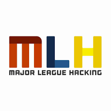
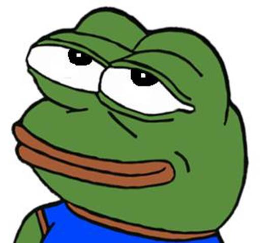
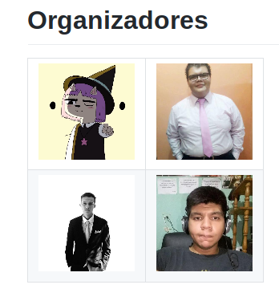

# Feliz año , yay :heart:!

# Metas

1. Crecer y expandirnos como comunidad y fortalecernos como miembros de está hermosa comunidad

2. Encontrar patrocinadores y fomentar nuevas y posibles alianzas

3. Code, babe, code! , es lo que nos gusta, no ?

# Organizadores

- David
- Mou
- Bryanlopezcodes
- Me

# Futuros eventos

- Anime (expo)

  Que vamo hacer?

  > Dar info sobre la comunidad y aprovechar a **vender o regalar** cosillas

- Horchata Migueleña

  Que vamo hacer?

  

  > Pos hostear a **Hochatajs** y juntarnos como comunidades de #coding

- Hack'nCode/nombre en discución/ SM

  Que vamo hacer?

  > Usar **iNJUVE** para montar nuestro propio hackathon buscando patrocinadores y de esa manera darnos a conocer más, incluso dar en simultaneo charlas y talleres

- Hackathon by **GitHub** y **MLH**

  

  

  Que vamo hacer?

  > El primero de diciembre exactamente estaremos en _linea_ o con una persona responsable como _colaborador_ externo a SV /quizá/, y terminaremos retos propuestos por **GitHub** y la comunidad o host de comunidades **MLH** , evento del cúal se nos aseguran **\$1000 usd** y **Swagging** de dichas comunidades :heart_eyes: :fire: :rocket:

# Como funkara NS-SM en este año?
Si recuerdan empezamos con **JS :heart_eyes:**, pero este año queremo proponer y hacer algo distinto, para luego aprender otros lenguajes, como **dart :sunglasses:**

- Como sería ?

Cáda sábado **even** se seguiria un *temario o curriculum* de temas, de el lenguaje de programación que se está aprendiendo.

Los otros sábados se mantendran para espacios de charllas y talleres,  disponible para todos los miembros

- Como miembro, que gano ?

Casi al culminar cada **temporada** del lenguaje que se sigue se dejara un proyecto **no es como la escuela o la U, o eso :bomb::bomb::bomb::fire:**

Lo que pasa es que se verá el interes de la persona por se parte y miembro activo de Nodeschool, así al culminar se le dara entrega de un muy buen merecido certificado por **300** horas en dicho lenguaje!
- Como mentor u organizador, que gano ?

Nada :scream::sob::sob:, bueno, que más que la dicha de haber impartido las "clases" de cáda sábado correspondiente al lenguaje de la temporada.

También así estas en el repositorio de github, al inicio del repo :hear::fire:

> PD: no hay mentores, de hoy en adelante los que fueron mentores/as , pasarían a ser **co-organizadores** ya que ellos invierten cierta parte de su tiempo ayudando a pensar como se organiza cáda evento

# Otros temas
- Diseño de camiseta :fire:
- Pensar en branding :heart:
- Buscar patrocinadores :crying_cat_face: