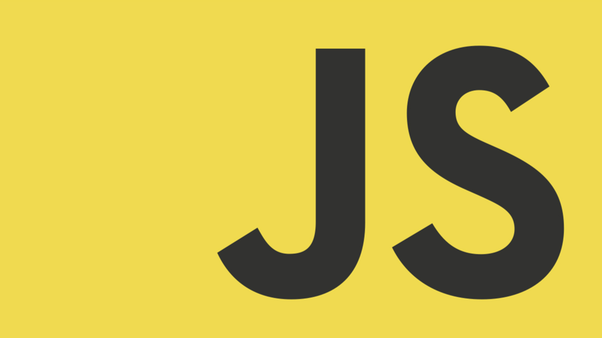
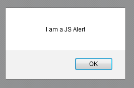
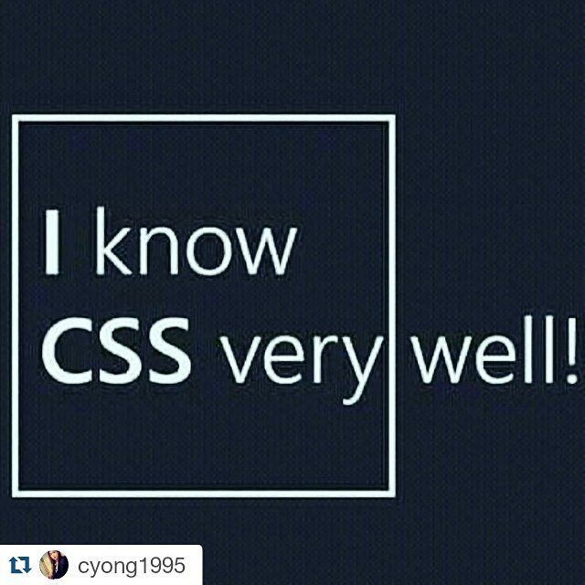
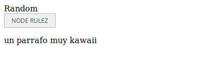
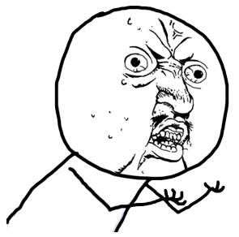
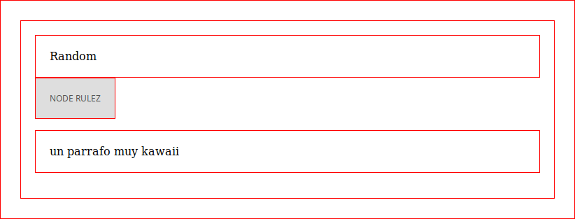
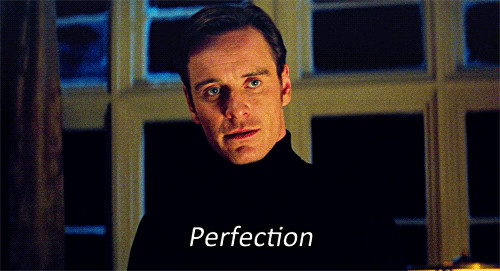
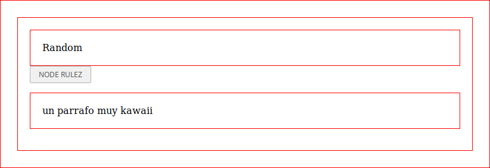

# Jugando con el DOM HTML y el Virtual DOM



Luego de repasar un poco que es el DOM y el Virtual DOM empezaremos nuestra aventura realizando una pequeñas practicas, yay!

## ¿Comó llamo un nodo html para manipularlo en Js?

Si se usa hardcoded js tenemos:

- getElementById("id")
  > Retorna el **primer** elemento con el id dado a buscar
- getElementsByClassName("clase")
  > Retorna una **lista** de elementos que contengan dicha clase
- querySelector("selector css")
  > Igual que getElementById, pero con la variante de seleccion por _selectores_ css
- querySelectorAll("selector css")
  > Igual que getElementsByClassName este retorna una lista de elementos, pero con la variante de querySelector

## Ejemplo

primero creamos un documento html de esqueleto y lo guardamos como vdom

```html
<!DOCTYPE html>
<html lang="es">
<head>
  <meta charset="UTF-8">
  <meta name="viewport" content="width=device-width, initial-scale=1.0">
  <meta http-equiv="X-UA-Compatible" content="ie=edge">
  <title>DOM Y Virtual DOM</title>
</head>
<body>
  <div class="dato">Random</div>
  <button id="boton">NODE RULEZ</button>
  <p class="tengo2clases dato">un parrafo muy kawaii</p>
</body>
</html>
```


## ¿Comó los modificamos?

pongamos en practica los metodos que acabamos de ver, primero llamemos un elemento por su id

> Recuerda que un id es un nombre identificador unicó que se le asigna a un nodo

```html
<body>
  <div class="dato">Random</div>
  <button id="boton">NODE RULEZ</button>
  <p class="tengo2clases dato">un parrafo muy kawaii</p>
</body>
```

Si nos fijamos solo podemos llamar a un elemento por esté metodo, así:

```javascript
let boton = document.getElementById("boton")
// a este punto podemos manipular el nodo a como querramos
```

Probemos agregar estilos al nodo

```javascript
boton.style.background = "white"
boton.style.color = "black"
boton.style.border = "2px solid purple"
boton.style.borderRadius = "4px"
boton.style.padding = "8px 30px"
```

Resultado:

<button style="background: white; color: black; border: solid 2px purple; border-radius: 4px; padding: 8px 30px">NODE RULEZ</button>

Ahora agreguemos un evento al nodo

```javascript
boton.onclick = () => alert("I am a JS Alert")
// provemos en el navegador
```

Resultado:



## Ahora con getElementsByClassName

```html
<body>
  <div class="dato">Random</div>
  <button id="boton">NODE RULEZ</button>
  <p class="tengo2clases dato">un parrafo muy kawaii</p>
</body>
```

Si te fijas, podemos llamar a 2 elementos por esté metodo, así:

```javascript
let datos = document.getElementsByClassName("dato")
// hagamos un console.log()

console.log(datos)`HTMLCollection [ div.dato, p.tengo2clases.dato ] vdom.html` // Salida
```

Ahora que poseemos 2 datos en una lista, avancemos a modificar el segundo, recordando que en una lista los elementos se pocicionan por indices, entonces

```javascript
console.log(datos[1])`<p class="tengo2clases dato"> vdom.html` // Salida
// Ahora modifiquemolo como el anterior pero con una diferencia, cheka acá

let tengo2clases = datos[1]
tengo2clases.style = `
  background: black; 
  color: pink; 
  border: solid dashed 2px pink; 
  padding: 30px; 
  font-size: 40px`
```



## Ahora con el ultra pro mega hardcore ECS6

Tenemos esto

```html
<body>
  <div class="dato">Random</div>
  <button id="boton">NODE RULEZ</button>
  <p class="tengo2clases dato">un parrafo muy kawaii</p>
</body>
```

### pero que pasa si quisiera poder modificar todo menos 1 elemento?

#### Intentemos con querySelectorAll

```javascript
let todaLaWea = document.querySelectorAll("*")
// bien ya tenemos todos los elementos
// psst incluye el body ya que es un selector css
// pongamos estilos a ver que pasa xD
todaLaWea.style = `
  border: solid red 1px;
  padding: 20px
`
```

Resultado:



> Que ha pasado?



```javascript
// pd: recuerdas que querySelectorAll retorna un Array?, yo tampoco xD
// Bien, entonces como accedemos a los nodos?
// recorramos cada nodo y agreguemos dichos estilos
let miEstiloPro = `
  border: solid red 1px;
  padding: 20px
`
todaLaWea.forEach(nodo => {
  nodo.style = miEstiloPro
})
```

Resultado:





## Pero bro, el objetivo es dar estilos a todo menos 1 elemento

### Hmmm, podemos hacer esto!

```javascript
// Reemplazemos el selector por
let todaLaWea = document.querySelectorAll("*:not(.button)")
// así modificaremos todos los elementos menos el tag "button" y miremos que pasa
```

Resultado:



# Reto

Te reto a crear parrafos dinamos de un array, con está estructura:

```javascript
let arr = [["titulo", "data"], ["titulo", "data"]]
```

Con esta estructura base

```html
<body>
  <div id="titulo">Mi Blog</div>
  <div id="entradas-de-blog">Data</div>
</body>
```

Debes agregar estilos basicos y además agregar las entradas del blog al nodo con id `entradas-de-blog`


# ¿Quieres más?

- https://www.smashingmagazine.com/2015/10/es6-whats-new-next-version-javascript
- https://www.w3schools.com/js/js_htmldom.asp
- https://developer.mozilla.org/es/docs/Web/CSS/Introducci%C3%B3n/Selectors
- https://librosweb.es/libro/css/capitulo_5/posicionamiento.html
- https://webdesign.tutsplus.com/es/articles/7-css-units-you-might-not-know-about--cms-22573
- https://css-tricks.com/template-literals/
- https://guides.github.com/pdfs/markdown-cheatsheet-online.pdf
