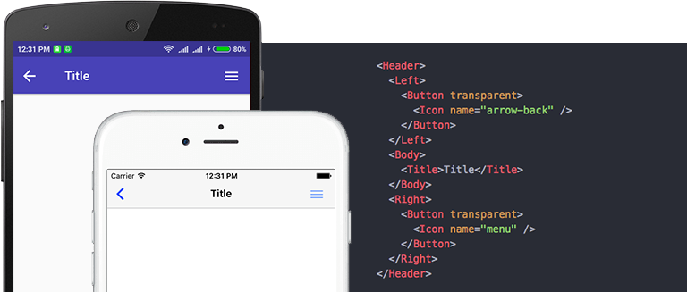
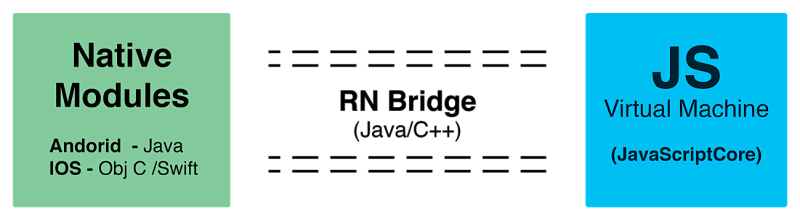
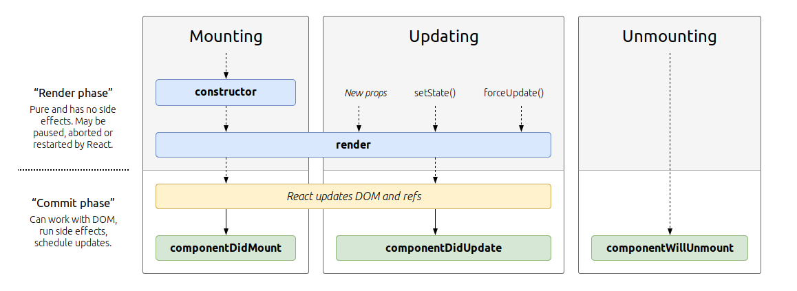
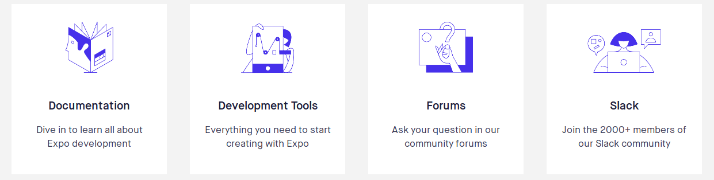
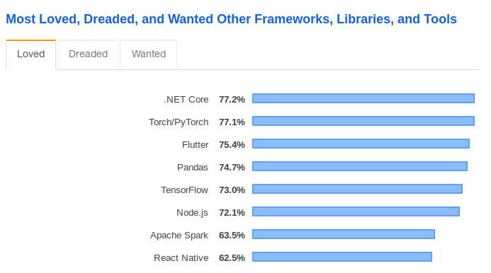
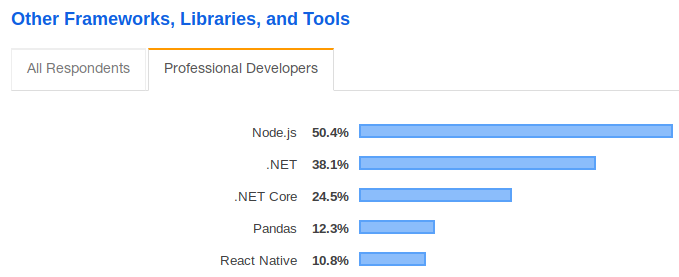
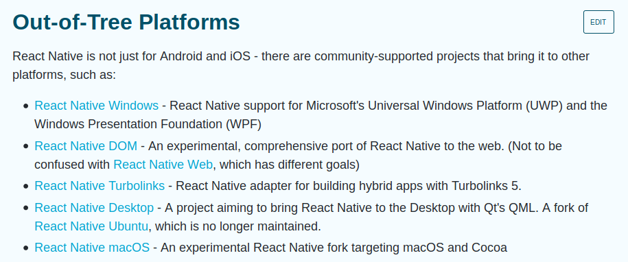

<!-- $size: 16:9 -->
<!-- $theme: gaia -->
<link href="https://fonts.googleapis.com/css?family=Rajdhani|Titillium+Web&display=swap" rel="stylesheet"> 
<link href="./assets/index.css" rel="stylesheet">


---

# Creando una app multiplataforma con ==React Native== :fire:

---

## ¿Que es React Native ?



---

## ¿Que es React Native ?

React Native es un framework creado por **Facebook** para crear applicaciones nativas usando **javascript** para Android,IOS, Desktop y la Web :computer:.

```js
import React from "react"
import { Text, View } from "react-native"

export default () => {
  return (
    <View>
      <Text>Hello from React Native!</Text>
    </View>
  )
}
```

---

## ¡Wot! ¿Cordova y otras no hacen lo mismo?

###### Si, pero dejame te explico. La principal diferencia entre **React Native** y las apps basadas en ==Cordova== es que en Cordova las apps se ejecutan dentro de una webview, mientras las apps con React Native renderizan utilizando componentes nativos.

---

# Stop talking and show me the ==:code:==

---

### Espera, espera, solo un repaso rápido de esto:

- Explicate como funciona react native, bro!
- Componentes y props
- Tipos de componentes en React
- Estado de un componente y su ciclo de vida
- Porqué aprenderlo ?
- Extras :blush:

---

## Que hay detras de RN ?



---

# Componentes y props

---

<br/>

## Un componente es una parte de tu UI dividido en piezas pequeñas que se vuelven reusables, independientes y qué además contienen su propia lógica y base de código.

<br/>

> ###### En realidad un componente es una función de javascript a la cúal se le pasan propiedades arbitrarias y esta retorna elementos de **React** describiendo que aparecerá en pantalla.

---

## Tambíen existen distintos componentes, entre ellos están

- Functional Components: - Son literalmente funciones que reciben parámetros cómo **propiedades**
- Class Components: - Un componente que extiende una simulación de clase con propiedades y métodos conocidos como: **Ciclos de vida de un componente**

---

## Ciclo de vida de un componente



> **Psst:** si has usado reactjs o vuejs te parecerá familiar :zap::laughing:

---

# Expo

### Expo.io

---

> Expo es como un Rails para RN. Ya hay muchas cosas solo para tomar y con la base de código correcta. Con expo no necesitas Android studio o Xcode. Solo escribes javascript en cualquier editor de texto de tu gusto.

</br>



---

# Porqué aprender?

---

### Demanda de trabajo
##### https://news.ycombinator.com/item?id=13623482

---



---



https://insights.stackoverflow.com/survey/2019

---

# Quieres más ?

---



https://facebook.github.io/react-native/docs/out-of-tree-platforms

---


https://blog.expo.io/expo-cli-and-sdk-web-support-beta-d0c588221375

---

# Denny Portillo

#### Frontend Developer | Organizador Nodeschool San Miguel

- dennyportillo@spotcloud.io
- d3portillo@gmail.com
- github.com/D3Portillo
- linkedin.com/in/d3portillo
- d3portillo.github.io

---


#### San Miguel

---

#### Instagram: https://www.instagram.com/nodeschoolsm/
</br>


---

#### Facebook: https://www.facebook.com/nodeschoolsm/
</br>


---

#### Website: https://nodeschool.io/sanmiguel
</br>


---


# ¡ Gracias !
