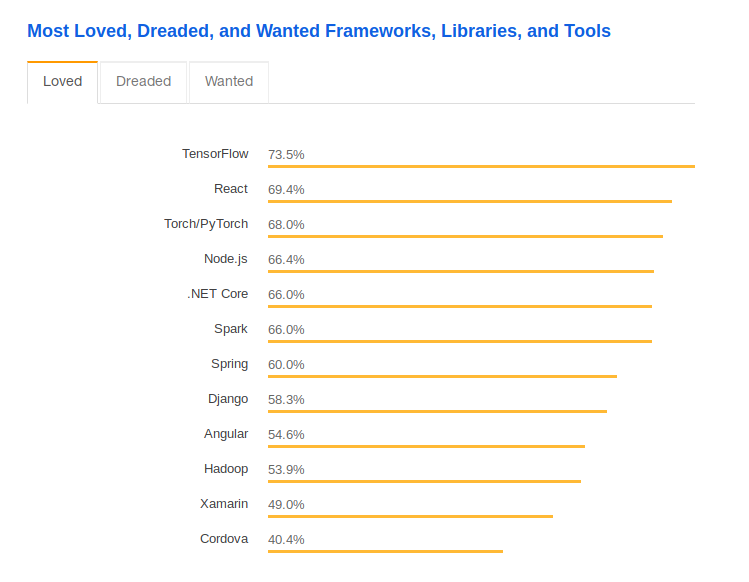
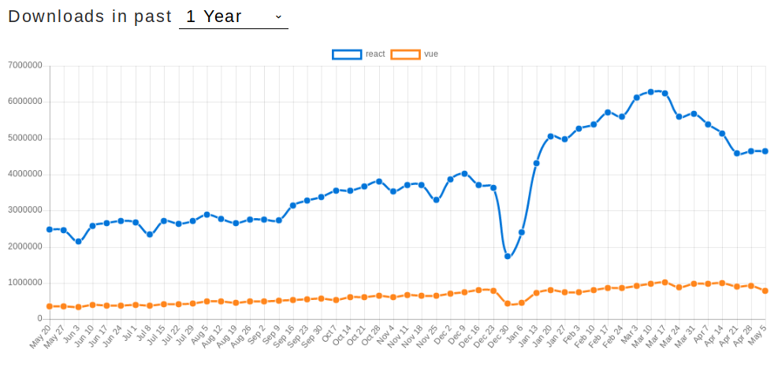

---

# Jugando con reactjs y vuejs

Denny Portillo d3portillo@gmail.com

---

# Vuejs

Vue (pronounced /vjuː/, like view) is a progressive framework for building user interfaces.

### Lo bueno

- Liviana comparada a otras
- Curva de aprendizaje corta
- Flexibilidad
- Buena documentación
- Contiene partes buenas de react y angular

---

# Reactjs

React is a JavaScript library for building user interfaces.

### Lo bueno

- Estabilidad de código
- Facil de empezar a aprender
- Si aprendes Reactjs luego puedes entrar a React Native
- Usado por más de 500 compañias y startups millonarias
- Un buen ecosistema para el desarrollador

---

# Ambas

Vue y React tienen pensado el desarrollo de UI pensando en componentes, flujo de dato para toda la jerarquia de componentes, renderizado con virtual dom, alto rendimiento, enviar propiedades o data entre componentes, y el manejo del estado de cáda componente dentro de la jerarquia de la webApp.

---

## Undirectional views and Virtual DOM

Unidirectional views are based on the idea of a **"Virtual DOM"** popularized by React. Instead of views manipulating the DOM directly, they describe the UI for any given state and this **"virtual DOM"** is diffed with the previous one to produce the minimal set of DOM operations necessary to repaint the page.

**Virtual DOM** sounds slow, right? Recreating the entire tree on every state change? Quite the contrary. This technique is widely used in the **game industry** and performs just as well for DOM updates.

---

## Framewors o librerias?

---

## Popularidad

---

NPM Trends

---

## Demanda de trabajo

|       | Indeed | LinkedIn |
| ----- | ------ | -------- |
| Vue   | 2,484  | 10,419   |
| React | 58,136 | 23,751   |

---

## Demanda de trabajo

|                                | Vue    | React  |
| ------------------------------ | ------ | ------ |
| Contratados                    | 18.47% | 38.38% |
| Conocimiento del desarrollador | 10.32% | 22.77% |

---

## Quienes usan React (Además de facebook) ?

- Airbnb
- Disqus
- PayPal
- The New York Times
- Netflix

---

## Quienes usan Vue

- Euronews
- Behance
- Alibaba
- Trustpilot
- Vice

--- 

## Aún no terminaos
> Coding coming!

--- 

## Ir a

https://reactjs.org/docs/getting-started.html
https://vuejs.org/v2/guide/